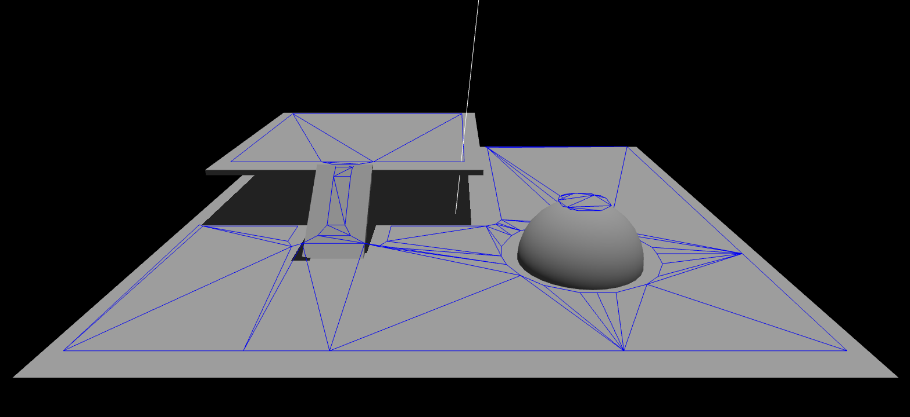

# ThreeJS - Navigation Mesh

Use RecastHelper to create a navigation mesh from ThreeJS geometry

1. Add the threeJS library as folder three
2. If you use npm install --save three, then change the importmap paths in example/index.html
3. Import RecastHelper
```
import { RecastHelper  } from "../recast/RecastHelper.js";
```
4. Create a new instance of RecastHelper
```
const helper = new RecastHelper();
```
5. Pass the scene or a Group and Params (optional) to the createNavMesh method of the helper
```
helper.createNavMesh(scene, {
  cellSize: 0.03,
  regionMinSize: 0.5,
  agentRadius: 0.3,
  agentHeight: 1.5
});

```
6. createNavMesh is an async promise. Add a then. It will receive the created mesh. 
```
helper.createNavMesh(scene, {
  cellSize: 0.03,
  regionMinSize: 0.5,
  agentRadius: 0.3,
  agentHeight: 1.5
}).then( (mesh) => { if (mesh){
  scene.add( mesh );
}
});
```

See the example for usage

